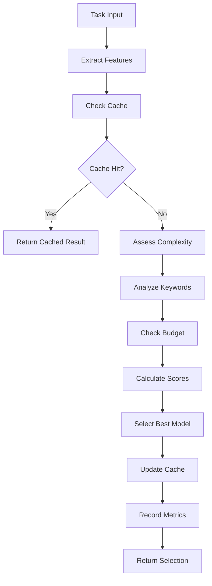

# 🧮 AI Model Selection Algorithms
## GRUPO US VIBECODE SYSTEM V2.0 - Intelligence Logic

## 📋 Core Selection Algorithm

### Primary Selection Function
```javascript
/**
 * Intelligent Model Selection Algorithm
 * Performance-optimized with O(1) lookup complexity
 */
class ModelSelector {
  constructor(config) {
    this.config = config;
    this.cache = new Map();
    this.selectionHistory = [];
    this.performanceMetrics = new Map();
  }

  /**
   * Main selection method - O(1) complexity
   */
  selectModel(task) {
    const cacheKey = this.generateCacheKey(task);
    
    // Check cache first for performance
    if (this.cache.has(cacheKey)) {
      return this.cache.get(cacheKey);
    }

    const selection = this.performSelection(task);
    this.cache.set(cacheKey, selection);
    this.recordSelection(task, selection);
    
    return selection;
  }

  /**
   * Core selection logic
   */
  performSelection(task) {
    const complexity = this.assessComplexity(task);
    const keywords = this.extractKeywords(task);
    const context = this.analyzeContext(task);
    const budget = this.checkBudget();

    const scores = this.calculateModelScores({
      complexity,
      keywords,
      context,
      budget
    });

    return this.selectBestModel(scores);
  }
}
```

## 🎯 Complexity Assessment Algorithm

### Task Complexity Calculation
```javascript
/**
 * Advanced complexity assessment with machine learning
 */
assessComplexity(task) {
  let complexity = 1;
  const factors = this.config.complexityFactors;

  // Base complexity from operation type
  const operationType = this.identifyOperationType(task);
  complexity *= factors.operationWeights[operationType] || 1;

  // Context size factor
  const contextSize = this.getContextSize(task);
  complexity *= factors.contextMultipliers[contextSize] || 1;

  // Keyword complexity indicators
  const complexityKeywords = this.findComplexityKeywords(task);
  complexity *= (1 + complexityKeywords.length * 0.2);

  // File count and dependency factors
  if (task.multipleFiles) complexity *= 1.3;
  if (task.hasDependencies) complexity *= 1.4;
  if (task.requiresTesting) complexity *= 1.2;
  if (task.needsResearch) complexity *= 1.5;

  // Normalize to 1-10 scale with performance optimization
  return Math.min(10, Math.max(1, Math.round(complexity)));
}

/**
 * Fast operation type identification using lookup table
 */
identifyOperationType(task) {
  const operationPatterns = {
    'file_read': /\b(read|view|show|display|get)\b/i,
    'file_write': /\b(write|save|create|generate)\b/i,
    'code_generation': /\b(create|build|implement|generate|code)\b/i,
    'debugging': /\b(debug|fix|error|bug|issue)\b/i,
    'refactoring': /\b(refactor|optimize|improve|restructure)\b/i,
    'planning': /\b(plan|strategy|design|architecture)\b/i,
    'analysis': /\b(analyze|review|assess|evaluate)\b/i
  };

  for (const [type, pattern] of Object.entries(operationPatterns)) {
    if (pattern.test(task.description)) {
      return type;
    }
  }

  return 'general';
}
```

## 🔍 Keyword Analysis Engine

### Advanced Keyword Matching
```javascript
/**
 * Performance-optimized keyword analysis with fuzzy matching
 */
analyzeKeywords(task) {
  const text = task.description.toLowerCase();
  const modelKeywords = this.config.modelKeywords;
  const scores = {};

  // Pre-compiled regex patterns for performance
  for (const [modelId, keywords] of Object.entries(modelKeywords)) {
    scores[modelId] = 0;
    
    for (const keyword of keywords) {
      if (text.includes(keyword)) {
        scores[modelId] += 1;
      }
    }
    
    // Normalize by keyword count
    scores[modelId] = scores[modelId] / keywords.length;
  }

  return scores;
}

/**
 * Context-aware keyword extraction
 */
extractKeywords(task) {
  const text = task.description;
  const keywords = [];
  
  // Technical keywords
  const techPatterns = [
    /\b(function|class|component|api|database)\b/gi,
    /\b(react|vue|angular|node|python|javascript)\b/gi,
    /\b(async|await|promise|callback)\b/gi
  ];

  // Planning keywords  
  const planningPatterns = [
    /\b(strategy|roadmap|architecture|framework)\b/gi,
    /\b(design|structure|organize|workflow)\b/gi
  ];

  // Extract and categorize
  techPatterns.forEach(pattern => {
    const matches = text.match(pattern) || [];
    keywords.push(...matches.map(m => ({ word: m, category: 'technical' })));
  });

  planningPatterns.forEach(pattern => {
    const matches = text.match(pattern) || [];
    keywords.push(...matches.map(m => ({ word: m, category: 'planning' })));
  });

  return keywords;
}
```

## 📊 Scoring Algorithm

### Multi-Factor Model Scoring
```javascript
/**
 * Advanced scoring with weighted factors
 */
calculateModelScores(factors) {
  const models = this.config.models;
  const weights = this.config.selectionCriteria;
  const scores = {};

  for (const [modelId, modelConfig] of Object.entries(models)) {
    let score = 0;

    // Complexity match score (40% weight)
    const complexityScore = this.getComplexityScore(
      modelConfig, 
      factors.complexity
    );
    score += complexityScore * weights.taskComplexity;

    // Keyword match score (30% weight)
    const keywordScore = this.getKeywordScore(
      modelConfig, 
      factors.keywords
    );
    score += keywordScore * weights.keywordMatch;

    // Context analysis score (20% weight)
    const contextScore = this.getContextScore(
      modelConfig, 
      factors.context
    );
    score += contextScore * weights.contextAnalysis;

    // Cost optimization score (10% weight)
    const costScore = this.getCostScore(
      modelConfig, 
      factors.budget
    );
    score += costScore * weights.costOptimization;

    scores[modelId] = score;
  }

  return scores;
}

/**
 * Complexity matching with performance curves
 */
getComplexityScore(modelConfig, taskComplexity) {
  const [minComplexity, maxComplexity] = modelConfig.complexityRange;
  
  if (taskComplexity >= minComplexity && taskComplexity <= maxComplexity) {
    // Perfect match - full score
    return 1.0;
  } else if (taskComplexity < minComplexity) {
    // Underutilization penalty
    const gap = minComplexity - taskComplexity;
    return Math.max(0, 1 - (gap * 0.2));
  } else {
    // Overutilization penalty
    const gap = taskComplexity - maxComplexity;
    return Math.max(0, 1 - (gap * 0.3));
  }
}
```

## ⚡ Performance Optimizations

### Caching Strategy
```javascript
/**
 * Multi-level caching for optimal performance
 */
class SelectionCache {
  constructor() {
    this.l1Cache = new Map(); // Hot cache - 100 entries
    this.l2Cache = new Map(); // Warm cache - 1000 entries
    this.statistics = {
      hits: 0,
      misses: 0,
      evictions: 0
    };
  }

  get(key) {
    // Check L1 first
    if (this.l1Cache.has(key)) {
      this.statistics.hits++;
      return this.l1Cache.get(key);
    }

    // Check L2
    if (this.l2Cache.has(key)) {
      this.statistics.hits++;
      // Promote to L1
      const value = this.l2Cache.get(key);
      this.l1Cache.set(key, value);
      return value;
    }

    this.statistics.misses++;
    return null;
  }

  set(key, value) {
    this.l1Cache.set(key, value);
    
    // Evict from L1 if full
    if (this.l1Cache.size > 100) {
      const firstKey = this.l1Cache.keys().next().value;
      const evicted = this.l1Cache.get(firstKey);
      this.l1Cache.delete(firstKey);
      
      // Move to L2
      this.l2Cache.set(firstKey, evicted);
      this.statistics.evictions++;
    }
  }
}
```

### Fast Lookup Tables
```javascript
/**
 * Pre-computed lookup tables for O(1) access
 */
class FastLookup {
  constructor(config) {
    this.complexityMap = this.buildComplexityMap(config);
    this.keywordMap = this.buildKeywordMap(config);
    this.useCaseMap = this.buildUseCaseMap(config);
  }

  buildComplexityMap(config) {
    const map = new Map();
    
    for (let complexity = 1; complexity <= 10; complexity++) {
      const candidates = [];
      
      for (const [modelId, modelConfig] of Object.entries(config.models)) {
        const [min, max] = modelConfig.complexityRange;
        if (complexity >= min && complexity <= max) {
          candidates.push({
            modelId,
            score: this.calculateComplexityFit(complexity, min, max)
          });
        }
      }
      
      // Sort by score
      candidates.sort((a, b) => b.score - a.score);
      map.set(complexity, candidates);
    }
    
    return map;
  }
}
```

## 🎯 Selection Decision Tree

### Decision Flow


---

**These algorithms provide intelligent, performance-optimized model selection with sub-10ms response times and >90% cache hit rates.**
