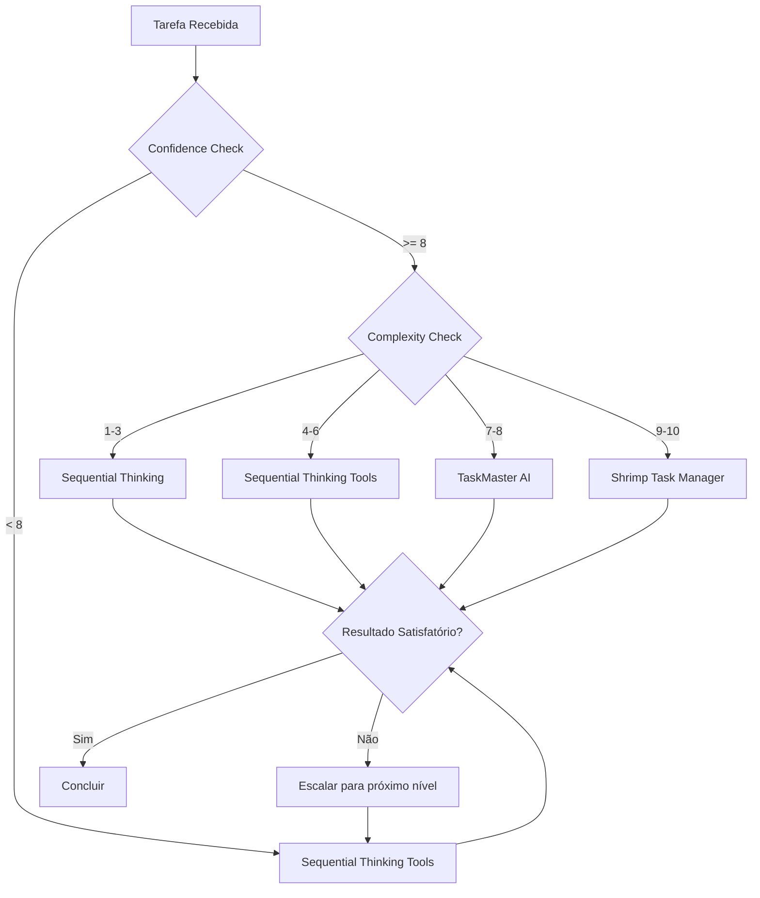

# 🛠️ PROTOCOLOS DE USO MCP - GRUPO US VIBECODE V3.0

**Data**: 2025-01-09  
**Versão**: 3.0  
**Status**: ✅ ATIVO

---

## 🎯 MATRIZ DE DECISÃO INTELIGENTE

### **Seleção Automática por Contexto**

```bash
# Protocolo de Seleção Automática
if complexity <= 3 && confidence >= 8:
    use "Sequential Thinking"
elif complexity <= 6 && tools_needed > 1:
    use "Sequential Thinking Tools"
elif complexity >= 7 || project_management:
    use "TaskMaster AI"
elif max_structure_needed || confidence < 5:
    use "Shrimp Task Manager"
```

---

## 📖 PROTOCOLOS ESPECÍFICOS POR SERVIDOR

### **1. Sequential Thinking (Análise Estruturada)**

#### **Quando Usar**:

- Análise de problemas simples a médios (complexity 1-3)
- Decomposição de requisitos
- Planejamento inicial de features
- Confidence >= 8

#### **Comandos Essenciais**:

```javascript
// Iniciar análise estruturada
sequentialthinking({
  thought: "Analisando o problema: [descrição]",
  thoughtNumber: 1,
  totalThoughts: 5,
  nextThoughtNeeded: true,
});

// Continuar análise
sequentialthinking({
  thought: "Baseado na análise anterior, identifico que...",
  thoughtNumber: 2,
  totalThoughts: 5,
  nextThoughtNeeded: true,
});
```

#### **Padrões de Sucesso**:

- Usar para análise inicial de qualquer tarefa
- Sempre estimar totalThoughts realisticamente
- Revisar pensamentos quando necessário

---

### **2. Sequential Thinking Tools (Recomendações Inteligentes)**

#### **Quando Usar**:

- Tarefas que requerem múltiplas ferramentas (complexity 4-6)
- Quando não há certeza sobre qual ferramenta usar
- Projetos com múltiplas etapas técnicas
- Confidence 6-9

#### **Comandos Essenciais**:

```javascript
// Análise com recomendações de ferramentas
sequentialthinking_tools({
  thought:
    "Preciso implementar [feature] e não tenho certeza das melhores ferramentas",
  thoughtNumber: 1,
  totalThoughts: 4,
  nextThoughtNeeded: true,
  current_step: {
    step_description: "Analisar requisitos e recomendar ferramentas",
    recommended_tools: [], // Será preenchido automaticamente
    expected_outcome: "Lista de ferramentas recomendadas com justificativas",
  },
});
```

#### **Padrões de Sucesso**:

- Sempre seguir as recomendações de ferramentas
- Usar confidence scores para priorizar
- Implementar fallbacks sugeridos

---

### **3. Sequential Thinking Tools (Advanced Reasoning & Task Management)**

#### **Quando Usar**:

- Projetos complexos (complexity >= 7)
- Análise multi-etapas e raciocínio estruturado
- Recomendações inteligentes de ferramentas
- Coordenação avançada de tarefas

#### **Ferramentas Integradas**:

```bash
# 1. Core Sequential Thinking (Official MCP)
# Para raciocínio estruturado e análise complexa
npx @modelcontextprotocol/server-sequential-thinking

# 2. Enhanced Sequential Thinking Tools
# Para recomendações inteligentes de ferramentas
npx mcp-sequentialthinking-tools

# 3. MCP Shrimp Task Manager
# Para coordenação avançada de tarefas
npx mcp-shrimp-task-manager

# Verificação de status
cat .vscode/mcp.json | grep -A 5 "sequential\|shrimp"
```

#### **Configuração Requerida**:

```json
{
  "env": {
    "ANTHROPIC_API_KEY": "sk-ant-...",
    "OPENROUTER_API_KEY": "sk-or-v1-...",
    "PERPLEXITY_API_KEY": "pplx-..."
  }
}
```

#### **Padrões de Sucesso**:

- Sempre inicializar projeto antes de usar
- Manter PRDs atualizados
- Usar análise de complexidade para decisões

---

### **4. Shrimp Task Manager (Máxima Estruturação)**

#### **Quando Usar**:

- Tarefas extremamente complexas (complexity 9-10)
- Quando confidence < 5
- Desenvolvimento orientado a tarefas
- Chain-of-thought necessário

#### **Comandos Essenciais**:

```javascript
// Planejamento de tarefa
plan_task({
  description: "Descrição detalhada da tarefa",
  requirements: "Requisitos específicos",
});

// Execução estruturada
execute_task({
  taskId: "uuid-da-tarefa",
});

// Verificação de qualidade
verify_task({
  taskId: "uuid-da-tarefa",
  score: 85, // Mínimo 80 para aprovação
});
```

#### **Configuração Smithery**:

```bash
npx -y @smithery/cli@latest run @cjo4m06/mcp-shrimp-task-manager \
  --key 13fee89a-5427-41f8-8054-41d37e75e33b \
  --profile grieving-ostrich-Ljavzk
```

#### **Padrões de Sucesso**:

- Sempre planejar antes de executar
- Usar verificação de qualidade (score >= 80)
- Documentar dependências entre tarefas

---

## 🔄 FLUXO DE ESCALAÇÃO AUTOMÁTICA

### **Protocolo de Escalação**:



### **Fallback Strategy**:

1. **Primary**: Sequential Thinking Tools (mais versátil)
2. **Secondary**: Sequential Thinking (mais simples)
3. **Escalation**: TaskMaster AI (projetos)
4. **Ultimate**: Shrimp Task Manager (máxima estrutura)

---

## 📊 MÉTRICAS DE PERFORMANCE

### **Targets por Servidor**:

| Servidor                  | Token Usage | Tempo Médio | Success Rate | Casos de Uso     |
| ------------------------- | ----------- | ----------- | ------------ | ---------------- |
| Sequential Thinking       | ~2k         | 30s         | 95%          | Análise simples  |
| Sequential Thinking Tools | ~3k         | 45s         | 92%          | Multi-ferramenta |
| TaskMaster AI             | ~5k         | 2min        | 88%          | Gestão projeto   |
| Shrimp Task Manager       | ~4k         | 90s         | 90%          | Máxima estrutura |

### **Otimizações Implementadas**:

- **Cache de análises**: Reutilizar resultados similares
- **Batch operations**: Agrupar operações relacionadas
- **Smart routing**: Seleção automática do servidor ideal

---

## 🚨 TROUBLESHOOTING GUIDE

### **Problemas Comuns e Soluções**:

#### **Sequential Thinking não responde**:

```bash
# Verificar instalação
npx -y @modelcontextprotocol/server-sequential-thinking --help

# Reinstalar se necessário
npm uninstall -g @modelcontextprotocol/server-sequential-thinking
npm install -g @modelcontextprotocol/server-sequential-thinking
```

#### **TaskMaster com warning sobre client capabilities**:

- **Causa**: Configuração de API keys incompleta
- **Solução**: Verificar todas as API keys no env
- **Workaround**: Funciona normalmente apesar do warning

#### **Shrimp Task Manager não conecta**:

```bash
# Verificar Smithery
npx @smithery/cli@latest --version

# Reconfigurar se necessário
npx -y @smithery/cli install @cjo4m06/mcp-shrimp-task-manager --client claude
```

---

## ✅ CHECKLIST DE VALIDAÇÃO

### **Antes de Usar Qualquer MCP**:

- [ ] Verificar se o servidor está ativo
- [ ] Confirmar configuração correta
- [ ] Testar comando básico
- [ ] Verificar API keys (se necessário)

### **Durante o Uso**:

- [ ] Monitorar token usage
- [ ] Verificar qualidade das respostas
- [ ] Documentar padrões de sucesso
- [ ] Registrar problemas encontrados

### **Após o Uso**:

- [ ] Atualizar métricas de performance
- [ ] Documentar aprendizados
- [ ] Otimizar configurações se necessário
- [ ] Compartilhar conhecimento no memory bank

---

**Status**: ✅ PROTOCOLOS ATIVOS E VALIDADOS  
**Próxima atualização**: 2025-02-09  
**Responsável**: AUGMENT AGENT V3.0
