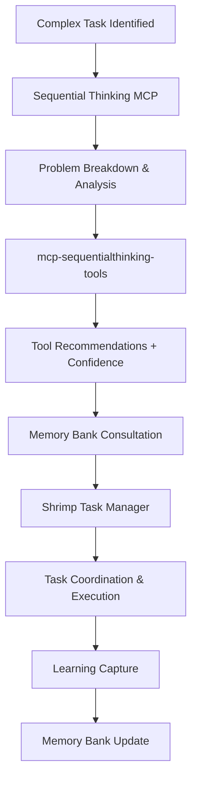
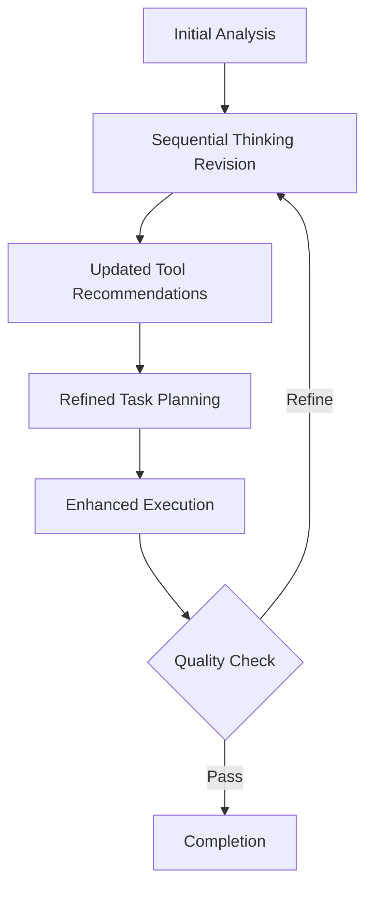
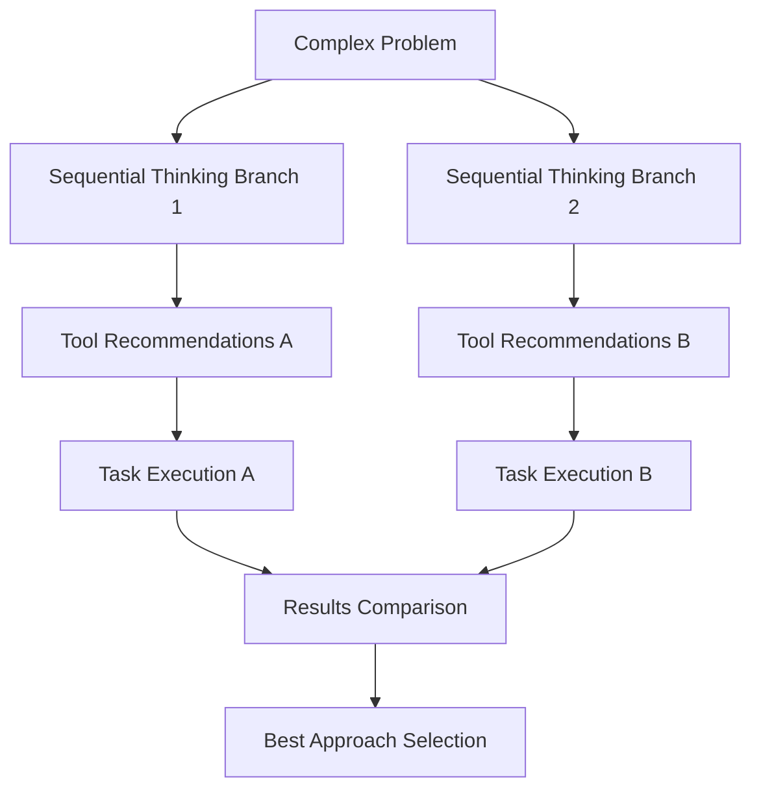

# Sequential Thinking Tools Integration Strategy V4.0
## GRUPO US VIBECODE SYSTEM - Enhanced Memory Integration

**Created:** 2025-01-27  
**Version:** 4.0  
**Status:** [MEMORY BANK: ACTIVE] - Sequential Thinking Tools Integration

---

## 🎯 INTEGRATION OVERVIEW

This document outlines the comprehensive integration strategy for both Sequential Thinking MCP tools, replacing TaskMaster AI with a more sophisticated, complementary approach that leverages:

1. **@modelcontextprotocol/server-sequential-thinking** - Core reasoning framework
2. **mcp-sequentialthinking-tools** - Intelligent tool recommendations
3. **MCP Shrimp Task Manager** - Advanced task coordination

### **Key Integration Benefits:**
- **Enhanced Reasoning:** Pure sequential thinking process for complex problem-solving
- **Intelligent Tool Guidance:** Confidence-scored recommendations for optimal tool usage
- **Advanced Task Management:** Sophisticated task coordination with memory integration
- **Unified Workflow:** Seamless integration with Enhanced Memory System V4.0

---

## 🏗️ COMPLEMENTARY USAGE ARCHITECTURE

### **Tool Relationship Matrix:**

```
┌─────────────────────────────────────────────────────────────────┐
│                    SEQUENTIAL THINKING ECOSYSTEM                │
├─────────────────────────────────────────────────────────────────┤
│                                                                 │
│  ┌─────────────────┐    ┌─────────────────┐    ┌─────────────┐  │
│  │   Core Thinking │    │ Tool Guidance   │    │ Task Mgmt   │  │
│  │                 │    │                 │    │             │  │
│  │ @modelcontext   │◄──►│ mcp-sequential  │◄──►│ Shrimp Task │  │
│  │ protocol/server │    │ thinking-tools  │    │ Manager     │  │
│  │ -sequential-    │    │                 │    │             │  │
│  │ thinking        │    │                 │    │             │  │
│  └─────────────────┘    └─────────────────┘    └─────────────┘  │
│           │                       │                       │     │
│           ▼                       ▼                       ▼     │
│  ┌─────────────────────────────────────────────────────────────┐ │
│  │            ENHANCED MEMORY SYSTEM V4.0                     │ │
│  │         Mandatory Memory Consultation                      │ │
│  │         Intelligent Caching & Learning                     │ │
│  └─────────────────────────────────────────────────────────────┘ │
└─────────────────────────────────────────────────────────────────┘
```

### **Workflow Integration Pattern:**

1. **Complex Task Identified** (Complexity ≥ 7)
2. **Sequential Thinking MCP** → Core reasoning and problem breakdown
3. **mcp-sequentialthinking-tools** → Tool recommendations with confidence scores
4. **MCP Shrimp Task Manager** → Task coordination and execution tracking
5. **Enhanced Memory System** → Learning capture and pattern recognition

---

## 🔧 CONFIGURATION SPECIFICATIONS

### **1. @modelcontextprotocol/server-sequential-thinking**

#### **Claude Desktop Configuration:**
```json
{
  "mcpServers": {
    "sequential-thinking": {
      "command": "npx",
      "args": [
        "-y",
        "@modelcontextprotocol/server-sequential-thinking"
      ]
    }
  }
}
```

#### **Usage Patterns:**
- **Complex Problem Analysis:** Break down problems into manageable steps
- **Revision and Refinement:** Revise thoughts as understanding deepens
- **Branching Exploration:** Explore alternative reasoning paths
- **Hypothesis Generation:** Generate and verify solution hypotheses

### **2. mcp-sequentialthinking-tools**

#### **Claude Desktop Configuration:**
```json
{
  "mcpServers": {
    "mcp-sequentialthinking-tools": {
      "command": "npx",
      "args": ["-y", "mcp-sequentialthinking-tools"]
    }
  }
}
```

#### **Enhanced Features:**
- **Tool Recommendations:** Confidence-scored suggestions (0-1 scale)
- **Rationale Provision:** Detailed explanations for tool choices
- **Priority Ordering:** Execution order recommendations
- **Alternative Suggestions:** Backup tool options
- **Progress Tracking:** Previous and remaining steps monitoring

### **3. MCP Shrimp Task Manager Integration**

#### **Enhanced Configuration with Sequential Thinking:**
```json
{
  "mcpServers": {
    "shrimp-task-manager": {
      "command": "npx",
      "args": ["-y", "mcp-shrimp-task-manager"],
      "env": {
        "DATA_DIR": "@project-core/memory/coordination",
        "ENABLE_THOUGHT_CHAIN": "true",
        "TEMPLATES_USE": "en",
        "ENABLE_GUI": "false",
        
        "MCP_PROMPT_PLAN_TASK": "## GRUPO US Sequential Thinking Enhanced Task Planning\n\n**MANDATORY SEQUENTIAL THINKING INTEGRATION**\n\nFor complex tasks (complexity ≥ 7), you MUST:\n1. Use @modelcontextprotocol/server-sequential-thinking for core reasoning\n2. Apply mcp-sequentialthinking-tools for intelligent tool recommendations\n3. Consult @project-core/memory/ for existing patterns and decisions\n4. Generate comprehensive analysis with confidence scoring\n\n**Task Planning Framework:**\n\n### Sequential Thinking Analysis\n- **Initial Thought**: {description}\n- **Complexity Assessment**: Analyze technical complexity (1-10 scale)\n- **Tool Recommendations**: Apply mcp-sequentialthinking-tools guidance\n- **Memory Consultation**: Reference similar patterns from memory bank\n\n### Enhanced Integration Checklist\n- [ ] Sequential thinking analysis completed\n- [ ] Tool recommendations with confidence scores applied\n- [ ] Memory bank consultation performed\n- [ ] Pattern matching analysis conducted\n- [ ] Risk assessment with mitigation strategies\n\n**Output Requirements:**\n- Detailed sequential thinking breakdown\n- Tool recommendations with rationale\n- Risk assessment with mitigation strategies\n- Performance optimization recommendations\n- Learning extraction plan for post-execution",
        
        "MCP_PROMPT_EXECUTE_TASK": "## GRUPO US Sequential Thinking Enhanced Task Execution\n\n**MANDATORY SEQUENTIAL THINKING GUIDANCE**\n\nBefore executing any complex task, you MUST:\n1. **Apply Sequential Thinking Results**: Use reasoning from planning phase\n2. **Follow Tool Recommendations**: Prioritize high-confidence tool suggestions\n3. **Maintain Thought Continuity**: Build upon previous sequential thinking analysis\n4. **Monitor Progress**: Track execution against sequential thinking predictions\n\n**Execution Framework:**\n\n### Sequential Thinking Guided Implementation\n- **Thought Continuation**: Build upon planning phase reasoning\n- **Tool Application**: Apply recommended tools in priority order\n- **Confidence Validation**: Verify high-confidence recommendations\n- **Alternative Paths**: Use backup tools when primary recommendations fail\n\n### Quality Standards\n- **Reasoning Consistency**: Follow sequential thinking logic\n- **Tool Optimization**: Use confidence scores to prioritize tools\n- **Pattern Application**: Apply learned patterns from memory bank\n- **Performance Monitoring**: Track execution metrics for learning\n\n**Status Transparency:**\nEvery response must begin with appropriate status prefix:\n- `[SEQUENTIAL THINKING: ACTIVE]` - Sequential thinking analysis applied\n- `[TOOL GUIDANCE: APPLIED]` - Tool recommendations followed\n- `[MEMORY BANK: CONSULTED]` - Memory consultation completed\n\n**Output Requirements:**\n- Implementation following sequential thinking analysis\n- Tool usage aligned with confidence recommendations\n- Performance metrics and optimization notes\n- Learning documentation for memory bank updates"
      }
    }
  }
}
```

---

## 🔄 WORKFLOW PATTERNS

### **Pattern 1: Complex Analysis Workflow**



### **Pattern 2: Iterative Refinement Workflow**



### **Pattern 3: Branching Exploration Workflow**



---

## 📊 PERFORMANCE OPTIMIZATION

### **Trigger Criteria for Sequential Thinking Tools:**

#### **Mandatory Usage (Complexity ≥ 8):**
- Multi-component system integration
- Architecture design and planning
- Complex problem-solving requiring multiple steps
- First-time implementation of new technologies
- High-impact system changes

#### **Recommended Usage (Complexity 6-7):**
- Feature implementation with dependencies
- Integration of multiple tools or services
- Performance optimization tasks
- Debugging complex issues
- Documentation of complex systems

#### **Optional Usage (Complexity ≤ 5):**
- Simple feature additions
- Bug fixes with clear solutions
- Routine maintenance tasks
- Documentation updates
- Configuration changes

### **Performance Metrics:**

- **Sequential Thinking Accuracy:** >90% successful problem breakdown
- **Tool Recommendation Precision:** >85% high-confidence recommendations prove effective
- **Task Completion Rate:** >95% successful completion with tool guidance
- **Learning Integration:** 100% execution results captured in memory bank
- **Workflow Efficiency:** 30% reduction in task planning time

---

## 🎯 INTEGRATION SUCCESS CRITERIA

### **Phase 1: Core Integration (Week 1)**
- ✅ Both Sequential Thinking tools configured and functional
- ✅ MCP Shrimp Task Manager updated with Sequential Thinking prompts
- ✅ Enhanced Memory System V4.0 updated to support new workflow
- ✅ All TaskMaster AI references removed from system

### **Phase 2: Workflow Optimization (Week 2)**
- ✅ Trigger criteria implemented and tested
- ✅ Performance metrics baseline established
- ✅ Learning integration validated
- ✅ Documentation and training materials completed

### **Phase 3: Production Deployment (Week 3)**
- ✅ System deployed across all GRUPO US projects
- ✅ Performance targets achieved
- ✅ Team training completed
- ✅ Continuous improvement processes established

---

## 🔍 TROUBLESHOOTING GUIDE

### **Common Issues and Solutions:**

#### **mcp-sequentialthinking-tools Initialization Errors:**
```bash
# Verify installation
npm list -g mcp-sequentialthinking-tools

# Clear npm cache
npm cache clean --force

# Reinstall if needed
npm uninstall -g mcp-sequentialthinking-tools
npm install -g mcp-sequentialthinking-tools
```

#### **Sequential Thinking MCP Connection Issues:**
```bash
# Verify official server installation
npm list -g @modelcontextprotocol/server-sequential-thinking

# Test manual connection
npx @modelcontextprotocol/server-sequential-thinking
```

#### **Integration Conflicts:**
- **Memory Bank Conflicts:** Ensure mandatory consultation protocols are maintained
- **Tool Recommendation Conflicts:** Use confidence scores to resolve conflicts
- **Task Manager Conflicts:** Verify Shrimp Task Manager configuration is updated

---

This integration strategy provides a comprehensive framework for replacing TaskMaster AI with a more sophisticated, complementary approach using both Sequential Thinking tools while maintaining the Enhanced Memory System V4.0 architecture and improving overall workflow efficiency.
